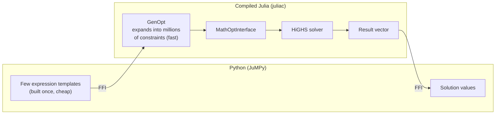

# JuMPy

A Python interface to [MathOptInterface](https://github.com/jump-dev/MathOptInterface.jl) via [GenOpt](https://github.com/blegat/GenOpt.jl).

JuMPy lets you build optimization models in Python at the speed of compiled Julia. It does this by constructing lightweight expression templates in Python and handing them off to a compiled Julia backend for constraint expansion and solving — keeping the expensive work out of Python entirely.

## Why JuMPy?

Python modeling libraries like Pyomo and CVXPY construct models at Python speed. For large-scale problems with millions of constraints, model construction can take longer than solving. JuMPy eliminates this bottleneck.

The key idea: most large models are a small number of **constraint groups** — a parametric template repeated over a large index set. JuMPy builds one expression template per group in Python, then [GenOpt](https://github.com/blegat/GenOpt.jl) expands it into individual constraints in compiled Julia.



The Python workload is proportional to the **number of groups**, not the number of constraints.

## Installation

```
pip install jumpy
```

No Julia installation required — JuMPy ships a precompiled solver backend built with [juliac](https://docs.julialang.org/en/v1/devdocs/juliac/).

## Quick start

```python
import jumpy as jp

m = jp.Model()
x = m.variables(100, lower=0, name="x")

# A constraint group: 99 constraints from one template
i = jp.Iterator(range(99))
m.constraint_group([i], x[i] + x[i + 1] <= 10)

m.objective = jp.minimize(x[0] + x[1])
m.optimize()

print(m.value(x[0]))
```

## Constraint groups

Constraint groups are the core feature. Instead of building constraints one by one in Python, you write a single expression template with symbolic iterators.

### Basic group

```python
i = jp.Iterator(range(1000000))
m.constraint_group([i], x[i] <= 10)
# One template in Python → 1,000,000 constraints in Julia
```

### Multi-dimensional

```python
i = jp.Iterator(range(100))
j = jp.Iterator(range(100))
m.constraint_group([i, j], x[100 * i + j] >= 0)
# 10,000 constraints from one template
```

### With data

```python
costs = jp.Parameter([...], name="costs")
demand = jp.Parameter([...], name="demand")

i = jp.Iterator(range(n))
m.constraint_group([i], costs[i] * x[i] >= demand[i])
```

### Nonlinear

```python
i = jp.Iterator(range(n))
m.constraint_group([i], jp.sin(x[i]) + jp.exp(x[i]) <= 1.0)
```

### Individual constraints

For one-off constraints that don't need grouping:

```python
m.constraint(x[0] + x[1] == 5)
```

## API reference

### Model

| Method | Description |
|---|---|
| `m = jp.Model()` | Create a new model |
| `m.variables(n, lower=, upper=, name=)` | Add `n` variables, returns a `VariableVector` |
| `m.variable(lower=, upper=, name=)` | Add a single variable |
| `m.constraint_group(iterators, template)` | Add a constraint group |
| `m.constraint(con)` | Add an individual constraint |
| `m.objective = jp.minimize(expr)` | Set a minimization objective |
| `m.objective = jp.maximize(expr)` | Set a maximization objective |
| `m.optimize()` | Solve the model |
| `m.value(var)` | Get the solved value of a variable |

### Expressions

Variables and iterators support standard arithmetic (`+`, `-`, `*`, `/`, `**`) and comparisons (`<=`, `>=`, `==`). Nonlinear functions are available as:

```python
jp.sin(x)   jp.cos(x)   jp.exp(x)
jp.log(x)   jp.sqrt(x)  jp.jp_abs(x)
```

### Symbolic indexing

`VariableVector` and `Parameter` support both concrete and symbolic indexing:

```python
x[0]          # concrete: returns Variable
x[i]          # symbolic: returns IndexedVariable (template node)
x[10*i + j]   # symbolic arithmetic on the index

costs[0]      # concrete: returns Constant
costs[i]      # symbolic: returns IndexedParameter (template node)
```

## Architecture

JuMPy has two layers:

1. **Python package** (`jumpy`): Builds expression graphs using operator overloading. The graph maps directly to `MOI.ScalarNonlinearFunction`. Serializes models to a flat array format for FFI.

2. **Compiled Julia library** (built with juliac): Bundles MathOptInterface + GenOpt + Bridges + HiGHS into a shared library with a C ABI. Reconstructs expression trees, expands constraint groups, and solves.

```
src/jumpy/
├── expressions.py   # Expression tree nodes with operator overloading
├── iterators.py     # Iterator — an Expr node usable in index arithmetic
├── serialize.py     # Flatten expression trees for the C ABI
└── model.py         # Model class, constraint groups, solver interface
```

## How it maps to Julia

| Python | Julia |
|---|---|
| `Iterator(range(n))` | `GenOpt.Iterator(n, values)` |
| `x[i]` (symbolic) | `MOI.VariableIndex` resolved during expansion |
| `x[i] + x[i+1] <= 10` | `MOI.ScalarNonlinearFunction` template |
| `m.constraint_group([i], ...)` | `GenOpt.IteratedFunction` |
| `Parameter([...])` | Data vector passed alongside iterators |

## Development

```bash
# Run tests
python3 tests/test_expressions.py

# Run example
python3 examples/basic.py
```

## Related projects

- [JuMP](https://github.com/jump-dev/JuMP.jl) — the Julia optimization modeling language
- [MathOptInterface](https://github.com/jump-dev/MathOptInterface.jl) — JuMP's solver abstraction layer
- [GenOpt](https://github.com/blegat/GenOpt.jl) — constraint group expansion
- [HiGHS](https://highs.dev/) — open-source LP/MIP solver

## License

MIT
